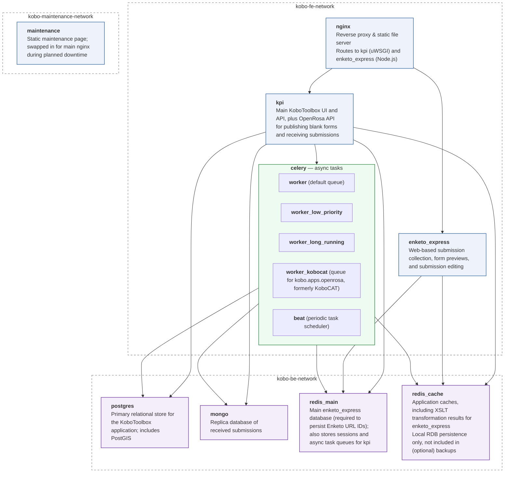

```mermaid
%%{init: {'flowchart': {'nodeSpacing': 35, 'rankSpacing': 60}}}%%
flowchart
  classDef svc fill:#eef3fb,stroke:#4472a8,stroke-width:1.5px,text-align:left;
  classDef worker fill:#eefbf0,stroke:#3f8f52,stroke-width:1.5px,text-align:left;
  classDef db fill:#f4eefb,stroke:#7a4aa8,stroke-width:1.5px,text-align:left;

  subgraph FE["kobo-fe-network"]
    nginx["<b>nginx</b><br/>Reverse proxy &amp; static file server<br/>Routes to kpi (uWSGI) and enketo_express (Node.js)"]
    enketo["<b>enketo_express</b><br/>Web-based submission collection, form previews, and submission editing"]
    kpi["<b>kpi</b><br/>Main KoboToolbox UI and API, plus OpenRosa API for publishing blank forms and receiving submissions"]
    subgraph celery["<b>celery</b> — async tasks"]
      worker["<b>worker</b> (default queue)"]
      worker_low_priority["<b>worker_low_priority</b>"]
      worker_long_running["<b>worker_long_running</b>"]
      worker_kobocat["<b>worker_kobocat</b> (queue for kobo.apps.openrosa, formerly KoboCAT)"]
      beat["<b>beat</b> (periodic task scheduler)"]
    end
    nginx --> enketo
    nginx --> kpi
    kpi --> celery
  end

  subgraph MAINT["kobo-maintenance-network"]
    maintenance["<b>maintenance</b><br/>Static maintenance page; swapped in for main nginx during planned downtime"]
  end

  subgraph BE["kobo-be-network"]
    postgres["<b>postgres</b><br/>Primary relational store for the KoboToolbox application; includes PostGIS"]
    mongo["<b>mongo</b><br/>Replica database of received submissions"]
    redismain["<b>redis_main</b><br/>Main enketo_express database (required to persist Enketo URL IDs); also stores sessions and async task queues for kpi"]
    rediscache["<b>redis_cache</b><br/>Application caches, including XSLT transformation results for enketo_express<br/>Local RDB persistence only, not included in (optional) backups"]
  end

  kpi --> postgres
  kpi --> mongo
  kpi --> redismain
  kpi --> rediscache
  celery --> postgres
  celery --> mongo
  celery --> redismain
  celery --> rediscache
  enketo --> redismain
  enketo --> rediscache

  class nginx,enketo,kpi,maintenance svc;
  class celery worker;
  class postgres,mongo,redismain,rediscache db;

  style FE fill:#ffffff,stroke:#999999,stroke-width:1.5px,stroke-dasharray: 5 5
  style BE fill:#ffffff,stroke:#999999,stroke-width:1.5px,stroke-dasharray: 5 5
  style MAINT fill:#ffffff,stroke:#999999,stroke-width:1.5px,stroke-dasharray: 5 5
```
